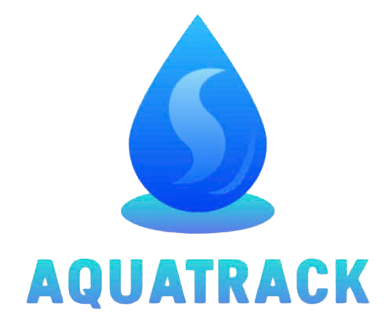

<!-- Optional Banner (Keep commented out unless you want it) -->
<!--  -->

<h1 align="center">Hi 👋, I'm Tran Huu Dat</h1>
<h3 align="center">I'm a Software Engineering student at Ton Duc Thang University (TDTU) from Vietnam.</h3>

 
<!-- Make sure 'type.gif' exists in your repository or replace the src with a valid URL -->

  

<!-- Optional Giphy Embed (Keep commented out unless you want it) -->
<!-- 
<iframe src="https://giphy.com/embed/vtm4qejJIl1ERPIrbA" width="100%" height="100%" style="position:absolute" frameBorder="0" class="giphy-embed" allowFullScreen></iframe>

<a href="https://giphy.com/gifs/knife-crab-pikaole-vtm4qejJIl1ERPIrbA">via GIPHY</a>
 -->

Here's a little bit about me:
- 🌱 I’m currently deepening my knowledge in **Web Development**.
- 👯 I’m open to collaborating on **Web Development projects**.
- 📫 How to reach me: **huudat.peashooer@gmail.com**
<!-- - ⚡ Fun fact: I identify with the ISTP personality type. -->

<h3 align="left">Connect with me:</h3>

  <!-- Twitter -->
  <!--  -->
  
  
  
  
  <!-- Discord -->
  <!--  -->

<h3 align="left">Languages and Tools:</h3>

 
  <!-- Commented out icons - uncomment if you use them -->
  <!--  -->
  <!--  -->
  <!--  -->
  
   
   
  
  <!--  -->
  <!--  -->
  
   
   
  
  <!--  -->
  
   
   
   
  <!-- Uncomented relevant icons -->
  
  
  
  
  

  
  <a href="https://github.com/TranHuuDat2004/github-readme-stats"> <!-- Corrected link wrapper for consistency -->
     
    <!-- Corrected username=TranHuuDat2004 -->
  </a>

  <a href="https://git.io/streak-stats">
     
    <!-- Adjusted card_width slightly, you can fine-tune this -->
  </a>

### 🏆 Academic Projects:

<strong>🌠Web Development</strong>

 

<strong>BrickShop - E-commerce for Building Blocks</strong>

Engineered an e-commerce hub for building block fans (Qman, Keeppley, LEGO). Key features include seamless product browsing, secure checkout, order management, and a dedicated administration dashboard for efficient business operations.

<ul>
<li><strong>Frontend:</strong> HTML5, CSS3, JavaScript, Bootstrap (Customer UI), Tailwind CSS (Admin UI)</li>
<li><strong>Backend:</strong> Node.js, Express.js</li>
<li><strong>Database:</strong> MySQL</li>
</ul>

 

<strong>ZStyle - Foundational E-commerce Website</strong>

Developed a foundational e-commerce website for clothing as a course project. Implemented core functionalities for users to explore fashion items and proceed through a basic purchase flow.

<ul>
<li><strong>Frontend:</strong> HTML5, CSS3, JavaScript</li>
<li><strong>Backend:</strong> PHP</li>
<li><strong>Database:</strong> MySQL</li>
</ul>

 

<strong>Omacha Shop - Full-stack Toy Store</strong>

A delightful e-commerce platform specializing in toys, developed as a full-stack web application. Features comprehensive online shopping experience for customers and a robust administration system for efficient management.

<ul>
<li><strong>Frontend:</strong> HTML5, CSS3, JavaScript, Bootstrap</li>
<li><strong>Backend:</strong> PHP</li>
<li><strong>Database:</strong> MySQL</li>
</ul>

 

<strong>📱 Mobile Development (Android - Java)</strong>

 

<strong>AquaTrack (Water_Reminder) - Hydration Companion App</strong>

Created AquaTrack, a native Android application promoting better hydration. Allows users to easily log water consumption, visualize progress towards daily goals, and store data persistently using Firebase Firestore.

<ul>
<li><strong>Platform:</strong> Android</li>
<li><strong>Language:</strong> Java</li>
<li><strong>Database:</strong> Firebase Firestore</li>
</ul>

 

<strong>🧠 Machine Learning</strong>

 

<strong>Handwriting Signature Recognition</strong>

Developed a machine learning model for authenticating handwritten signatures. This project explores techniques for feature extraction and classification to verify signature authenticity.

<ul>
<li><strong>Language:</strong> Python</li>
<li><strong>Libraries/Frameworks:</strong> TensorFlow, Keras, scikit-learn, OpenCV</li>
</ul>

---

### 🚀 Personal Projects & Live Demos (GitHub Pages):

 

<strong>ANIME.TV - World of Anime & Manga</strong>

<blockquote>
<ul>
    <li><strong>Description:</strong> A Crunchyroll-inspired static website built to explore and enjoy Anime & Manga content. A personal project for learning and skill development.</li>
    <li><strong>🔗 Live Demo:</strong> <a href="https://tranhuudat2004.github.io/anime.tv/">https://tranhuudat2004.github.io/anime.tv/</a></li>
    <li><strong>💡 Key Features:</strong> Video player, image/GIF galleries, manga reader.</li>
    <li><strong>Tech Stack:</strong> HTML5, CSS3, Vanilla JavaScript, GitHub Pages.</li>
</ul>
</blockquote>

 

<strong>Puzzle & Image Tools Suite</strong>

<blockquote>
<ul>
    <li><strong>Description:</strong> An engaging web application featuring an interactive jigsaw puzzle game and a set of practical image manipulation tools (square cropper, grid splitter, resizer). Designed for entertainment and utility.</li>
    <li><strong>🔗 Live Demo:</strong> <a href="https://tranhuudat2004.github.io/games_tools/">https://tranhuudat2004.github.io/games_tools/</a></li>
    <li><strong>💡 Key Features:</strong> Jigsaw puzzle with diverse image collections and intuitive drag & drop. Image tools: Crop to square, split into grid, resize with aspect ratio control.</li>
    <li><strong>Tech Stack:</strong> HTML5, CSS3, JavaScript, Bootstrap.</li>
</ul>
</blockquote>

 

<strong>MyMusic Player Interface</strong>

<blockquote>
<ul>
    <li><strong>Description:</strong> A sleek, modern online music player interface inspired by platforms like Spotify. This project showcases UI/UX design skills and front-end development proficiency with a focus on a clean, responsive, and interactive user experience.</li>
    <li><strong>🔗 Live Demo:</strong> <a href="https://tranhuudat2004.github.io/mymusic/">https://tranhuudat2004.github.io/mymusic/</a></li>
    <li><strong>💡 Key Features:</strong> Intuitive music playback controls (play/pause, progress, volume). Responsive design for desktop and mobile. Dynamic UI elements built with vanilla JavaScript.</li>
    <li><strong>Tech Stack:</strong> HTML5, CSS3, JavaScript (ES6+).</li>
</ul>
</blockquote>

---

*   ➡️ Explore more of my projects in the [Repositories tab](https://github.com/TranHuuDat2004?tab=repositories).

---

  <strong>Thanks for visiting!</strong> 
  <!-- Hoặc bạn có thể dùng: **Thanks for visiting!** -->

   
  <!-- Make sure 'coding.gif' exists or replace src -->

